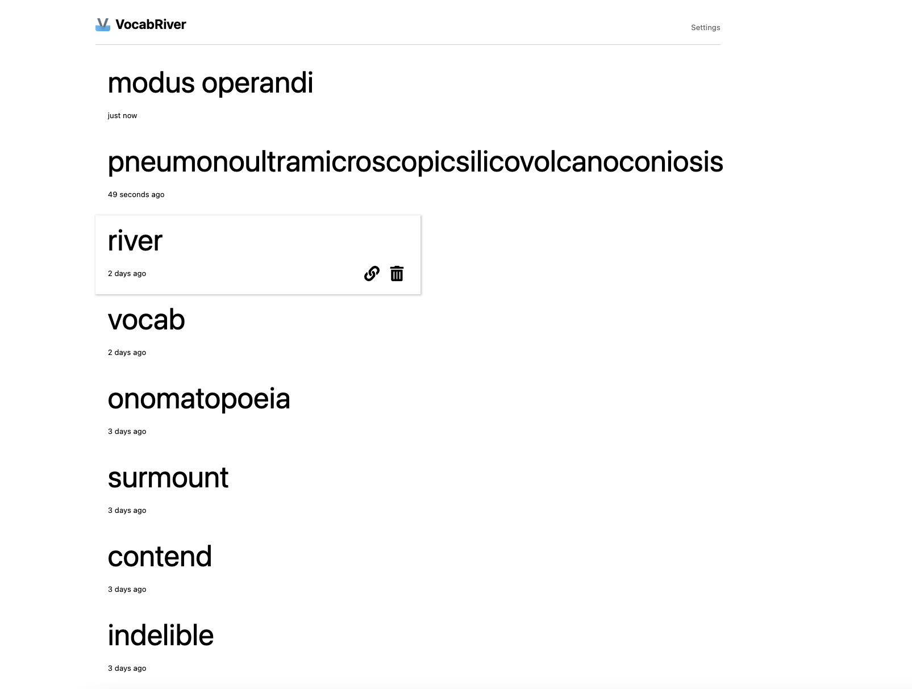

# VocabRiver

A Chrome extension that helps you build vocabulary naturally from your browsing history.

* Automatically captures vocabulary from dictionary sites you visit (dictionary.com, google define, etc.)
* Creates elegant flashcards that flow naturally into your learning routine
* Shows your vocabulary discoveries on the new tab page
* Streamlined, minimalist interface for effortless vocabulary building

## Installation
1. Download VocabRiver (and unzip if you downloaded the zipped file)
2. In Chrome: "Manage Extensions" → turn on "Developer mode" → "Load unpacked" → choose the VocabRiver directory
3. Start browsing and let your vocabulary river flow!

